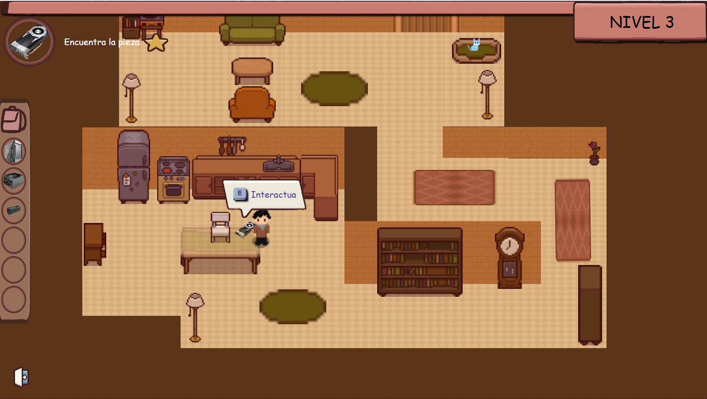

# Proyecto de la Primera Evaluación

## Descripción

"BUSCA PC" es un juego de aventuras en tercera persona 2D TOPDOWN 
VIEW que te sumerge en el mundo de la tecnología. Eres un niño curioso 
en busca de una emocionante misión: recolectar las 5 piezas esenciales de 
una computadora (Torre, PSU, RAM, GPU, CPU, Placa Base) en 5 niveles 
únicos, cada uno representando un entorno y un desafío diferentes. El juego 
comienza con un nivel de tutorial que te familiariza con los controles y las 
mecánicas. 
Todo está orientando con el fin de familiarizar al usuario con los distintos 
componentes  que  forman  un  ordenador  de  una  manera  divertida  y 
entretenida.

## Capturas de pantalla

## Enlace a la presentacion PDF

[Enlace al MEMORIA.pdf](MEMORIA.pdf)

## Instalación

Para instalar y ejecutar este proyecto, sigue los siguientes pasos:

1. Bien desde la seccion de descarga de github o bien desde BUSCA-PC_installer folder, puedes descargar el instalador y ejecutarlo.

¡Y eso es todo! Ahora puedes disfrutar del proyecto de la segunda evaluación.

