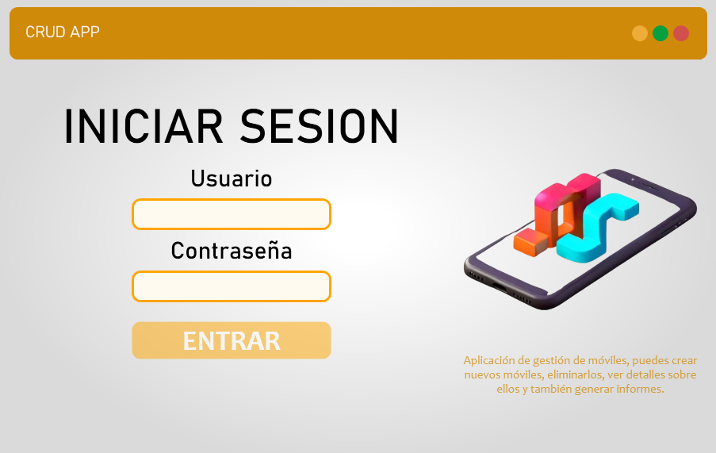
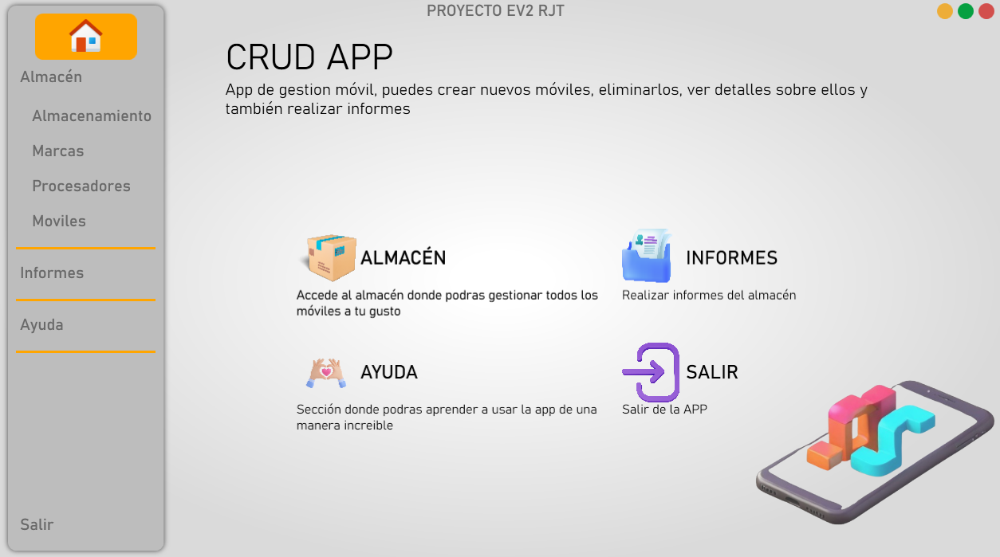
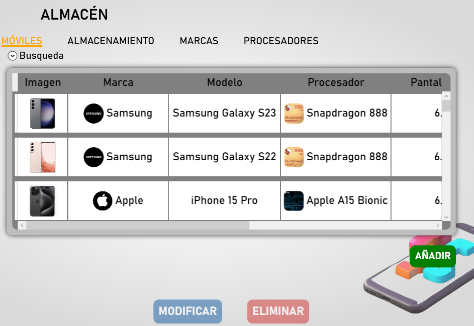
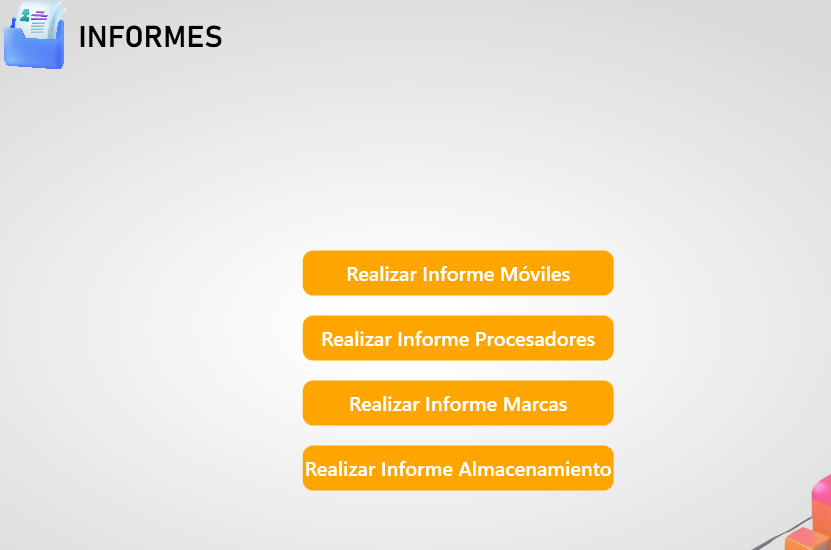
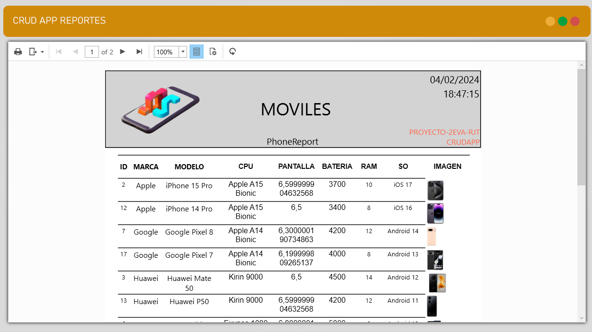

# Proyecto de la Segunda Evaluación

## Descripción

CRUD-APP es mucho más que una simple aplicación de gestión móvil; es tu aliado perfecto 
para administrar tu almacén de una manera atractiva y altamente intuitiva. Con la capacidad 
de  realizar  operaciones  CRUD  (Crear,  Leer,  Actualizar,  Eliminar)  en  marcas,  procesadores, 
almacenamientos  y  móviles,  CRUD-APP  consolida  toda  la  gestión  en  una  única  y  potente  
aplicación.

## Capturas de pantalla

## Enlace a la presentacion PDF

[Enlace al proyecto2eva.pdf](PROYECTO2EVA.pdf)

## Instalación

Para instalar y ejecutar este proyecto, sigue los siguientes pasos:

1. Bien desde la seccion de descarga de github o bien desde InstaladorCRUD-APP folder, puedes descargar el instalador y ejecutarlo.

2. Abre el archivo [Instrucciones de instalación](./SOFTWARE%20ADICIONAL%20NECESARIO/Readme.md) para obtener información detallada sobre los requisitos y pasos de instalación adicionales para el correcto funcionamiento.

3. Sigue las instrucciones proporcionadas en el archivo mencionado anteriormente para configurar el entorno y ejecutar el proyecto.

¡Y eso es todo! Ahora puedes disfrutar del proyecto de la segunda evaluación.

